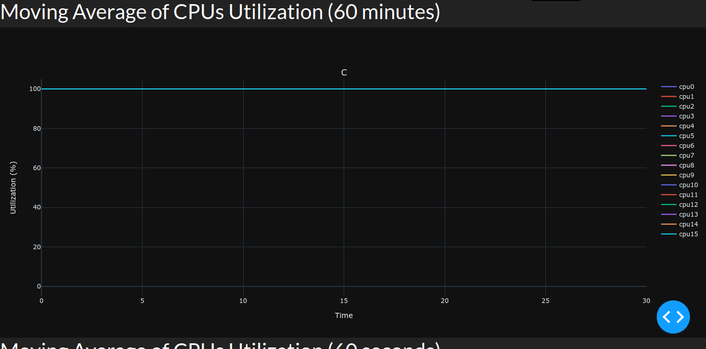
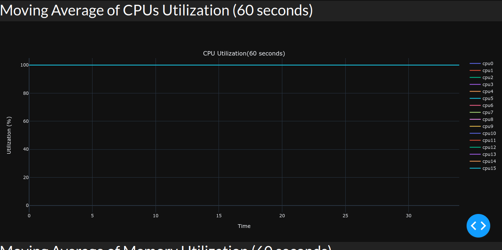
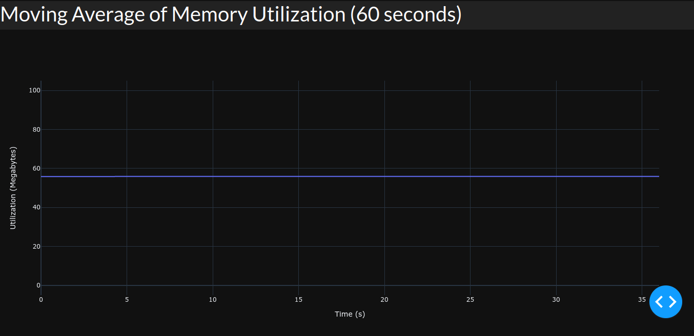

# Part 2

Vinicius Julião Ramos - 2018054630

See the screenshots of the three graphs for each computed metric in this work:

* 
  Time series for at most 400 queries to Redis. In the graph above, all the CPU are reporting 100% of usage, so the blue line is overwriting the other ones.

 

 

* 
  Time series for at most 400 queries to Redis. In the graph above, all the CPU are reporting 100% of usage, so the blue line is overwriting the other ones.

 

* 
  Time series for at most 400 queries to Redis. In the graph above, the moving average monitored has reported that a sort of 59% of the total virtual memory is allocated.

 

In this work we've computed three moving averages in which two are related to the CPU usage and a third one measure the memory allocation behavior.
So, as well as it was requested by the assignment description, the two first metrics calculate the moving average of the CPU usage in 60 minutes and also in 60 seconds. To do that, the `handler` function stores in `context.env` the the CPU usage information of the last our. It is computed by calculating the difference between the current time (`input['timestamp']`) and the stored timestamps in the `context.env`.

The same thing is done to calculate the moving average for the memory allocation. However, since we are calculating only the last 1 minute, we just store the data that were received till one minute before the current timestamp.
