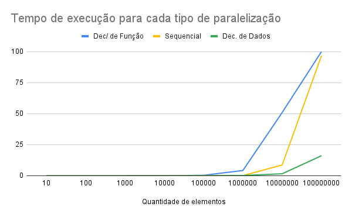
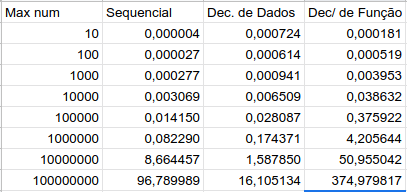

# Exercício de Programação 1
Vinicius Julião Ramos - 2018054630

## Introdução
Este trabalho tem como objetivo paralelizar um programa sequencial em duas
maneiras diferentes: Decomposição por domínio e decomposição por função.
Na primeira versão, trata-se de dividir os dados manipulados pelo programa
de maneira que cada thread trate uma parte dos dados e ao final, todos
os dados tenham sido tratados.
Já no segundo tipo de decomposição, uma mesma função manipulará todos os dados
porém não executará todos os procedimentos necessários, ou seja, cada thread
é encarregada de aplicar um (ou alguns) dos procedimentos.
Neste ultimo tipo de decomposição, as threads conhecem todos os dados, porém não
executam todos os procedimentos, diferentemente do primeiro tipo, o qual
uma thread executa todos os procedimentos, porém, para uma parte dos dados.

Em resumo, este exercício trata-se de executar cinco funções distintas em um
intervalo de números de 0 a $X$, em que $X$ é definido pelo argumento
passado na chamada de execução do programa.
Estas cinco funções são independentes entre si, e validam se determinado número
atende às propriedades definidas.
Entretanto, há uma sexta propriedade que valida se todas as cinco anteriores foram
satisfeitas.
Por fim, após o calculo das seis propriedades, é necessário utiliza-se tais
propriedades para computar dados que posteriormente são impressos no relatório
final de execução.

## Decomposição de dados
Para cumprir a paralelização de dados, inicialmente definiu-se que a quantidade
de threads disparadas pelo programa seria estática, e é dada pelo atributo
`MAX_THREADS` no arquivo `numcheckdatapar.c`.
Para a entrega deste exercício, o atributo tem valor igual a `4`.
À nível de código, em comparação com o arquivo `numcheckseq.c`, as alterações
concentram-se em dois pontos principais na função: `check_num()`:
1. Tal função agora é chamada pelo disparo de uma thread e tem como argumento
   um argumento do tipo `th_attributes`, o qual possui apenas dois valores
   inteiros.
   Tais valores indicam o início e o fim do intervalo de computação daquela
   thread.
   Por consequência houve a necessidade de adicionar um laço `for` para iterar
   sobre o intervalo.
2. Adição de uma *mutex* em torno da chamada de `update_max()`.
   Essa chamada acessa uma região crítica que acessa (leitura e escrita)
   valores comuns entre todas as threads.
   A mesma *mutex* também protege a atualização das variáveis globais que
   computam a quantidade de números que atenderam à cada propriedade.
   ```c
    pthread_mutex_lock(&lock);
    // Atualiza os contadores por condição
    palindromes += pal;
    repeated_seqs += rep;
    sums_are_ap += sum;
    have_tripled_digits += dou;
    have_four_repetitions += fou;
    if (all>0) {
        match_some_test += 1;
    }
    update_max( orign, all );
    pthread_mutex_unlock(&lock);
   ```


## Decomposição por função
Para esta decomposição, disparou-se uma thread para cada uma das seguintes funções:
- `is_palindrome()`
- `has_repeated_seq()`
- `sum_is_ap()`
- `has_tripled_digits()`
- `has_four_repetitions()`

Apesar de todas as threads serem chamadas de uma mesma função, também com o
nome de `check_num()`, o argumento recebido pela função determinará qual, dentre
as cinco funções acima, será executada naquela thread.
Para isso, armazenamos a função numa variável `check_property` e também um ponteiro
para a variável global correta `property`.
Logo, assim que `check_property` é executado, bloqueamos a *mutex* a fim de
computar a propriedade `match_some_test`.

A divisão em funções, tornou necessário o uso de uma tabela hash para mapear
aqueles número que já haviam completado uma primeira validação de
propriedade, mas que ainda não completaram todas as computações.
Por isso, na primeira checagem de determinado número, inserimos
esse número no mapa `_not_completed` e então chamamos a função `_check_all()`.
Essa ultima chamada valida se um numero contido no *hash map* já teve todas
as propriedades checadas, e em caso positivo, remove aquele elemento do mapa,
uma vez que não será mais necessário computar novamente a propriedade
`math_some_test`.
Todo esse trabalho é realizado quando uma thread está de posse da *mutex*,
então, ao fim dessa função a trava é liberada.

## Análise de execução
Dada a natureza do problema, observa-se que se trata de um problema de fácil
paralelização.
Entretanto, é necessário destacar e observar qual será a paralelização mais adequada.
De antemão, é possível afirmar que o problema sequencial não é justificável por si só, uma vez que há execução de cinco funções independentes entre si
além de não haver dependência entre os dados.
Logo, espera-se que a paralelização contribua positivamente para tal tarefa.




O experimento que resultou nos dados acima foi considerou um intervalo de números entre `10` e `100000000` para a entrada do programa (**Max num**).
Os tempos de execução de **Sequencial**, **Dec. de Dados** e
**Dec/ de Função** são dados em unidades de *segundo*.
Entretanto, é necessário ressaltar que a versão de decomposição de função foi muito mais custosa do que as demais.
E para que o gráfico não aumentasse muito a escala, não prosseguimos além desse intervalo no teste de tempo de execução.
Tanto o programa sequencial, quando a versão de decomposição de
dados, foram executadas com sucesso para entradas maiores que
$10^{9}$, retornando valores corretos em tempo hábil.
Porém, dada a dependência de acesso à memória, que é protegida
por mecanismos de exclusão mútua, na decomposição funcional,
o tempo gasto para computar entradas maiores que $10^8$ ultrapassa
a casa dos *segundos* e chega muito pŕoximo à dezenas de *minuto*.

Um outro fator de importância quanto à implementação da decomposição por função se dá pelo fato de que apenas uma
thread consegue agrupar as informações das propriedades de um
número a fim de computar `update_max()`.
Portanto, enquanto outras 4 threads inserem valor na tabela
hash, apenas uma thread tenta esvaziá-la.
Ou seja, há muito mais produtores do que consumidores, logo
há uma concorrência desproporcional que causa uma grande sobrecarga
na memória, e faz com que a versão de decomposição funcional não seja tão eficaz.
Uma alternativa para escapar do alto consumo de memória seria
limitar a inserção no *hash map* a partir de variáveis de condição.
Mas mesmo com essa abordagem, para evitar condições de corrida, só
é possível fazer com que uma única thread execute a função
`_check_all`, o que não surte melhora no tempo de execução.
