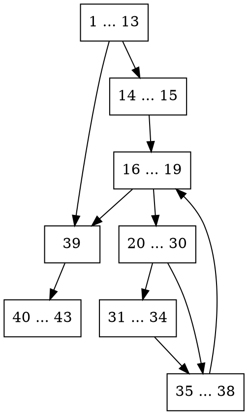
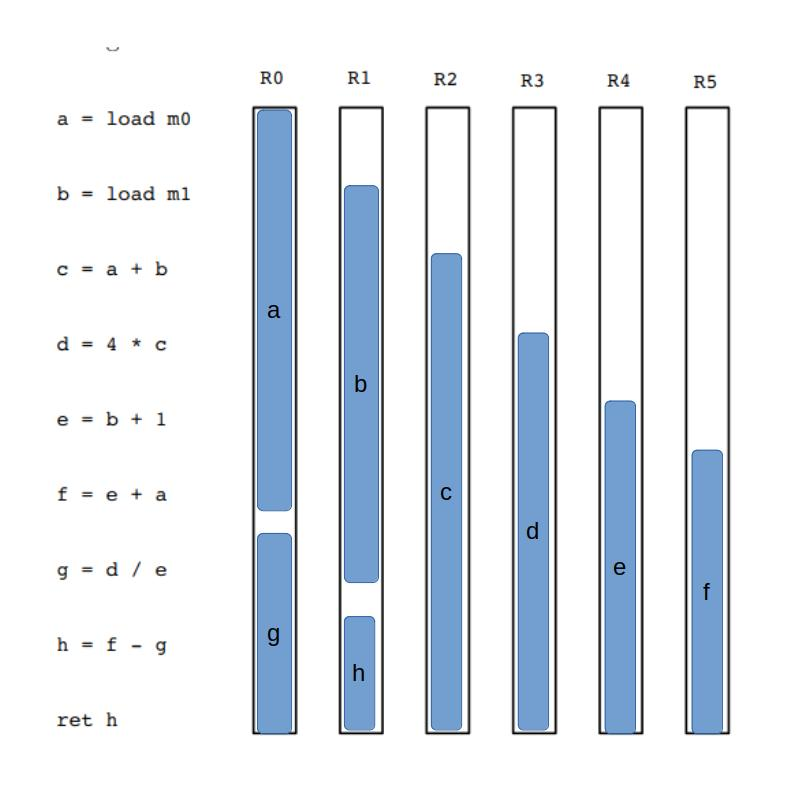

# DCC888 - Exercise List 1

Name: Vinícius Julião Ramos\
ID: 2018054630

## 1.a)




## 2.a)
The Constant Propagation optimization creates a map to propagate values between
the existent variables.
So the generated map will read the program from the beginning an creating the
following map:
```
i -> 1
j -> 1 + 1
k -> 1
l -> 1 + 1
```
And finally the program will be:
```cpp
i = 1
j = 2
k = 1
l = 2
```
However, the Value Numbering Optimization creates the following map:
(see the symbol `~->` as a transformation operation)
```
i -> 1
j -> (+, i, 1) ~-> (+, 1, 1)
k -> (i) ~-> 1
l -> (+, k, 1) ~-> (+, i, 1) ~-> (+, 1, 1)
```
Then, the generated code will be:
```cpp
i = 1
j = 2
k = 1
l = 2
```

## 2.b)
For that code, since we don't have defined constants, it is not possible to
propagate them.
So, using Constant Propagation Optimization, the code shall be kept the same
as before.
Differently, the Value Numbering is capable to transform that code, even that
the value of `i` is not defined.
The following map, shows the Value Numbering correspondence and its
transformations:
```
i -> (in, _)
j -> (+, i, 1)
k -> i
l -> (+, k, 1) ~-> (+, i, 1) ~-> j
```
Then, the optimized code will avoid recomputing `k+1 = i+1 = j`, resulting as
follows:
```cpp
i = read()
j = i + 1
k = i
l = j
```

## 2.c)
```cpp
a = i + 1
b = a
i = j
if j + 1 goto L1
c = j + 1
```

## 2.d)
The Value Numbering table would be given by:
```cpp
x -> (in, _)
y -> (in, _)
z -> (in, _)
a -> (v, x, y)
b -> (v, x, y) ~-> a
t1 -> (!, z)
x -> (!, z) -> ~-> t1
c -> (&, x, y) ~-> (&, t1, y)
d -> (&, x, y) ~-> (&, t1, y) ~-> c
```
Resulting code:
```cpp
a = x ∨ y
b = x ∨ y
t1 = !z
if t1 goto L1
x = t1
c = t1 & y
if c goto L2
d = c
```

## 3.a)


## 3.b)
Yes, I can.
Imagine that registers and memory are bins, and variables are bars.
So we want to minimize the number of used bins.
Since we already have a fixed number of registers, we can add a constraint to provide the initial
number of bins.
Then it is necessary pack every variable in a register, or in the memory.

## 3.c)
We can use Operational Search to solve the packing problem.
Then, our expression and its constraints will be given by the following linear
programming expression:
$$
\min B = \sum^{n}_{i=1}y_i \newline
s.t.\newline
\sum^n_{j=1}a_jx_{ij} \leq V_{y_i},\ \forall i \in \{1,\ldots,n\}\newline
\sum^n_{j=1}x_{ij} = 1,\ \forall j \in \{1,\ldots,n\}\newline
y_i \in \{0,1\},\  \forall i \in \{1,\ldots,n\}\newline
x_{ij} \in \{0,1\},\ \forall i \in \{1,\ldots,n\}\ \forall j \in \{1,\ldots,n\}\newline
$$
Where $B$ is the number of bins.

Using linear algebra, we can prove that this expression has solution.
